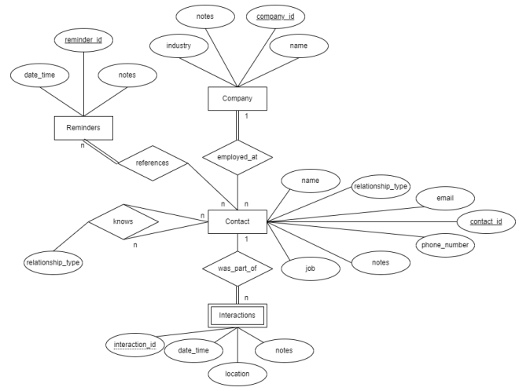

# Personal Relationship Manager

## Background

This project is motivated by the needs of entrepreneurs and business professionals trying to advance their career. Many
companies make use of Customer Relationship Managers (CRMs) to maintain relationships with customers, leads, and
potential business partners. A CRM acts as a contact book as well as a repository for key information on a customer and
the contents of their interactions with the company. CRMs also frequently have functionality which reminds companies to
reach out to individuals who have not been contacted recently. This brings about the concept of the Personal
Relationship Manager (PRM). The CRM ideology can be applied to the personal relationships of professionals attempting to
build or maintain a strong network of connections, allowing them to build a rapport in relationships which may otherwise
have been left unattended. This will allow for professionals to focus on the work in front of them, rather than have to
constantly worry about tending relationships with people who may be useful contacts in the future, but whom they are not
actively working with. CRMs currently exist in two forms. Classically, CRMs are found in the form of spreadsheets and
have the relationship information entered manually. These are fairly common for low-budget companies. CRM web apps also
exist, however these are very expensive and are used mainly by larger companies. Many PRMs are run in the manual form as
they are very accessible, and the cost of a company license for a CRM is not feasible for a single individual. The Mogul
P-CRM and Nat P-CRM are examples of companies whose products try to resolve the PRM problem by offering subscription
services to their PRM apps. These services store all of the information a CRM would, in addition to web-scraping to find
more contact information, and reminders to contact individuals whose communications have gone cold. Google Sheets is an
example of a spreadsheet software in which manual CRMs and PRMs are written. This software only stores information, and
doesn’t offer any additional insights. The goal of this project is to create a lightweight PRM to allow for the
organization of contacts made by an individual as well as the organization of interactions found between an individual
and said contacts.

## ER Diagram

</img>

## Info

The database dump can be found in /db_dump and can be executed to recreate the database used for this project

## Project demonstration
https://www.youtube.com/watch?v=agk1dVbMLcU
